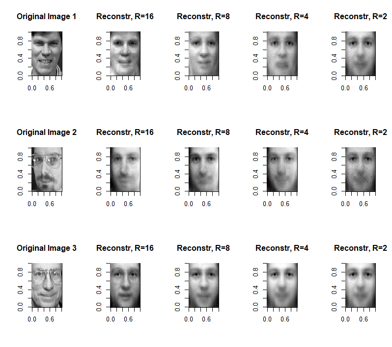
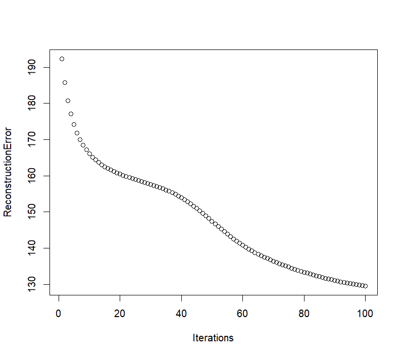

# Low-Rank Approximation of Face Images with NMF

Non-negative matrix factorisation implemented from scratch in R, used to
compress a 400 x 4096 dataset of 64x64 greyscale face images and study the
trade-off between rank and reconstruction quality.

University coursework, graded 82%.

## Problem

Given a non-negative data matrix `V` (400 images, each flattened to 4096
pixels), find non-negative matrices `W` (400 x r) and `H` (r x 4096) whose
product approximates `V`. Because r is much smaller than 4096, storing W and H
instead of V is a form of lossy compression, and r controls how much detail
survives.

## Approach

Everything below is implemented directly, without calling an existing NMF
implementation:

- **Initialisation** (`mat_init`) - builds W and H from supplied uniform random vectors.
- **Frobenius norm** (`frob`) and **reconstruction error** (`err_frob`) - measures ||V - WH||.
- **Multiplicative update rules** (`up_W`, `up_H`) - the Lee and Seung updates,
  with an epsilon term (1e-9) in the denominator to avoid division by zero.
- **Fitting loop** (`lowrank_fit`) - alternates the W and H updates, tracking the
  error each iteration, and stops when the relative change in reconstruction
  error falls below delta (1e-3) or a 500-iteration cap is reached.

The model was fitted at ranks r = 2, 4, 8 and 16 and the reconstructions
compared against the originals.

## Compression achieved

Storing W and H costs r(400 + 4096) entries against 1,638,400 for the full matrix:

| Rank r | Stored entries | % of original | Compression |
|--------|---------------|---------------|-------------|
| 16     | 71,936        | 4.4%          | 22.8x       |
| 8      | 35,968        | 2.2%          | 45.6x       |
| 4      | 17,984        | 1.1%          | 91.1x       |
| 2      | 8,992         | 0.55%         | 182.2x      |

## Results

- Reconstruction quality falls as r decreases, as expected.
- At r=4 the fit converged in roughly 129 iterations, well inside the 500 cap,
  indicating further iterations would not have meaningfully reduced the error.
- The most interesting result is that even at the most aggressive
  compression, the reconstructions remain recognisably faces rather than noise.

## Files

- `NMF.R` - full implementation and analysis.
- `CW2_25.RData` - the image dataset (`V`).

## Reproducibility note

The original random seed was derived from my university email, which has been
obscured in the source. Set `my_seed` directly to reproduce a run; results will
differ numerically from those reported above but the qualitative pattern holds.
